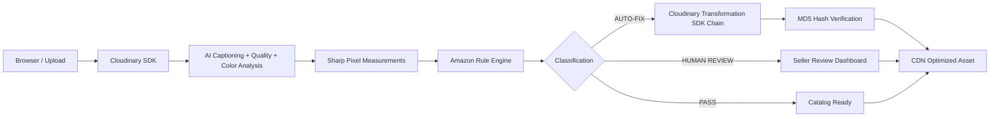

# ListReady

**Product image compliance and quality control layer for marketplace sellers.**

> "Fix your product photos before the marketplace does."

[](https://github.com/HackIndiaXYZ/pixels-to-products-cloudinary-ai-hackathon-2026-bankai)
[](https://cloudinary.com)
[](#hackathon-track)

---

## Live Demo

**Deployed application:** [https://list-ready.vercel.app](https://listready-eight.vercel.app/)

> The live deployment is the judge-facing demo. No local setup is required for evaluation.

---

## Overview

**ListReady** is an automated product-truth and media-quality control system built for e-commerce merchants and marketplace sellers. It evaluates candidate product photos against configured marketplace image guidelines, detects compliance and representation issues, safely auto-corrects remediable flaws via Cloudinary AI transformations, and routes uncertain or high-risk cases to human review.

ListReady features **Product Truth Guard** — a flagship differentiator designed to verify that candidate imagery accurately represents the intended product attributes, variants, and included accessories rather than merely passing automated visual rules.

---

## Product Interface


*ListReady Marketing & Product Media Control Center*


*Amazon Main Image Compliance Dashboard & Transformation Controller*


*Developer Verification Lab — Diagnostic Execution Bench*

---

## Why ListReady?

Marketplace main image requirements are strict, specific, and frequently enforced. Non-compliant photos lead to suppressed listings, rejected catalog submissions, lost search impressions, and account risk.

However, existing photo tools suffer from two major flaws:

1. **Over-Automation Risk**: Blindly auto-correcting every image can distort product attributes (e.g. altering original item colors, cropping out key accessories, or introducing visual artifacts).
2. **Visual-Only Validation**: Traditional checks verify pixel ratios or background RGB but fail to catch product identity mismatches (e.g., showing a 2-pack when selling a 1-pack, or displaying a wrong color variant).

ListReady addresses both problems by enforcing a **three-tier classification model** (PASS, AUTO-FIX, HUMAN REVIEW) and pairing deterministic pixel analysis with semantic AI inference.

---

## Core Product Flow

```
UPLOAD  ──►  ANALYZE  ──►  CLASSIFY  ──►  FIX  ──►  APPROVE  ──►  EXPORT
```

1. **UPLOAD**: Secure direct buffer streaming to Cloudinary or preset test asset fetch.
2. **ANALYZE**: Multi-modal analysis combining Cloudinary AI Captioning, Quality Analysis, Color Analysis, and Sharp deterministic pixel measurements.
3. **CLASSIFY**: Evaluating 9 rule modules against Amazon Main Image guidelines to assign every check a PASS, AUTO-FIX, or HUMAN REVIEW status.
4. **FIX**: Executing structured Cloudinary transformation chains (`e_background_removal`, `c_pad`, `f_jpg,q_auto`) with binary hash MD5 verification for AUTO-FIX items.
5. **APPROVE**: Presenting transformed results alongside Product Truth Guard evidence for seller verification.
6. **EXPORT**: Serving optimized, verified assets via Cloudinary CDN delivery URLs.

---

## Product Truth Guard

**Product Truth Guard** is ListReady's signature capability. While standard checkers only measure technical compliance, Product Truth Guard checks whether the photo represents the **actual product being sold**.

```
Candidate Asset ──┐
                  ├─► Product Truth Guard ─► Observed Evidence ─► Match / Mismatch / Seller Review
Reference Metadata ┘
```

### Key Capabilities

- **Attribute & Variant Verification**: Compares detected item colors and attributes against candidate metadata.
- **Quantity & Accessory Auditing**: Surfaces discrepancies between listing text (e.g. "Single shoe") and detected visual evidence (e.g. "Pair of sneakers").
- **Evidence-Based Reporting**: Uses objective classification terminology (*Observed Evidence*, *Potential Mismatch*, *Requires Review*).
- **Preservation of Uncertainty**: When AI confidence is limited or scene context is ambiguous, the system flags the item for seller review rather than generating a false positive.


---

## Marketplace Compliance Engine

ListReady currently enforces the **Amazon Main Image Policy Ruleset** across 9 distinct compliance categories:

| Rule Category | Evaluation Method | Threshold / Criteria | Safe Action |
|---|---|---|---|
| **Background Whiteness** | Sharp Border Sampling | Pure white (RGB ≥ 242,242,242) | `AUTO-FIX` (`e_background_removal` + `b_white`) |
| **Source Resolution** | Sharp Metadata | Longest side `max(w,h) >= 1000px` | `HUMAN REVIEW` (re-upload required) |
| **File Format** | Sharp Format Verification | JPEG/JPG standard | `AUTO-FIX` (`f_jpg,q_auto`) |
| **Framing Coverage** | Sharp Foreground Bounding | Foreground occupies 85–90% canvas | `AUTO-FIX` (`c_pad,w_2000,h_2000`) |
| **Lifestyle Context** | AI Caption Semantic Inference | Non-isolated environment / props | `HUMAN REVIEW` (seller decision) |
| **Promotional Text** | AI Captioning Text Detection | Sales badges, graphics, text overlays | `HUMAN REVIEW` (source edit needed) |
| **Watermarks** | AI Captioning Watermark Check | Logos, copyrights, seller markings | `HUMAN REVIEW` (source edit needed) |
| **Product Cutoff** | AI Caption Crop Check | Truncated edges or borders | `HUMAN REVIEW` (re-framing required) |
| **Multiple Items** | AI Caption Count Detection | Unrelated props / multi-item clutter | `HUMAN REVIEW` (catalog audit) |

### Three-State Classification System

- **`PASS`**: Image fully satisfies the target requirement.
- **`AUTO-FIX`**: Non-compliance detected, but a safe, non-destructive Cloudinary transformation is available.
- **`HUMAN REVIEW`**: Non-compliance detected, but automated transformation could distort product truth. Seller intervention required.

---

## Safety-Oriented Automation & Binary Hash Verification

ListReady ensures transformation integrity through **MD5 Binary Hash Verification**:

1. Before applying an AUTO-FIX transformation, ListReady computes the original asset hash.
2. The transformation chain is executed via Cloudinary.
3. The transformed asset hash is computed and compared against the original.
4. If hashes are identical, or if a transformation error occurs, ListReady explicitly sets status to `failed` and returns `transformedUrl: null`.
5. ListReady **never** silently substitutes the original asset as a false "success".

---

## Cloudinary Integration Architecture

Cloudinary is the **core media infrastructure layer** powering ListReady's pipeline:



### Cloudinary APIs & Transformations Used

| Capability | Cloudinary API / SDK Parameter | Purpose |
|---|---|---|
| **Secure Stream Upload** | `cloudinary.uploader.upload_stream` | Direct server-side streaming |
| **AI Scene Captioning** | `detection: 'captioning'` | Semantic compliance inference |
| **Visual Quality Scoring** | `quality_analysis: true` | Focus & sharpness scoring |
| **Color Histogram** | `colors: true` | Dominant palette extraction |
| **AI Background Removal** | `effect: 'background_removal'` | Non-destructive foreground extraction |
| **Canvas Normalization** | `background: 'rgb:FFFFFF', crop: 'pad'` | 2000×2000px pure white padding |
| **Format Optimization** | `fetch_format: 'jpg', quality: 'auto'` | Web-optimized Amazon JPEG delivery |
| **Signed Security** | Signed URL generation with SHA-256 header | Production-safe asset delivery |


---

## Tech Stack

- **Framework**: Next.js 16 (App Router, Turbopack, React 19)
- **Styling**: Tailwind CSS v4, Lucide React Icons
- **Media Processing**: Cloudinary Node.js SDK v2
- **Pixel Analysis**: Sharp (C++ libvips binding)
- **Deployment**: Vercel
- **Security**: Strict CSP, SSRF Hostname Allowlisting, Server-side API Secret Isolation

---

## Local Development & Setup

### Prerequisites

- Node.js 18.x or 20.x
- Cloudinary account credentials (`CLOUDINARY_CLOUD_NAME`, `CLOUDINARY_API_KEY`, `CLOUDINARY_API_SECRET`)

### Quickstart

```bash
git clone https://github.com/HackIndiaXYZ/pixels-to-products-cloudinary-ai-hackathon-2026-bankai.git
cd pixels-to-products-cloudinary-ai-hackathon-2026-bankai
npm install
cp .env.example .env.local
```

Edit `.env.local` with your Cloudinary credentials:

```env
CLOUDINARY_CLOUD_NAME=your_cloud_name
CLOUDINARY_API_KEY=your_api_key
CLOUDINARY_API_SECRET=your_api_secret
```

Start the development server:

```bash
npm run dev
```

Open [http://localhost:3000](http://localhost:3000) in your browser.

---

## Verification & Testing

### TypeScript Check
```bash
npx tsc --noEmit
```

### Production Build
```bash
npm run build
```

### Developer Verification Lab
Access `/test-pipeline` locally to inspect individual rule outputs, raw JSON payloads, and Cloudinary transformation headers.

---

## Security & Privacy

- **Server-Side API Secret**: `CLOUDINARY_API_SECRET` is used exclusively in server-side API routes (`/api/analyze`, `/api/fix`, `/api/upload`).
- **SSRF Allowlisting**: External image fetching in `/api/analyze` is strictly restricted to trusted delivery domains (`res.cloudinary.com`, `images.unsplash.com`).
- **Security Headers**: Production responses include `X-Frame-Options: DENY`, `X-Content-Type-Options: nosniff`, `Referrer-Policy: strict-origin-when-cross-origin`, and strict CSP policies.

---

## Hackathon Submission Details

- **Event**: Pixels to Products — Cloudinary AI Hackathon 2026
- **Track**: PS-01 · AI Media Pipelines
- **Repository**: [https://github.com/HackIndiaXYZ/pixels-to-products-cloudinary-ai-hackathon-2026-bankai](https://github.com/HackIndiaXYZ/pixels-to-products-cloudinary-ai-hackathon-2026-bankai)
- **Live Demo**: [https://list-ready.vercel.app](https://list-ready.vercel.app)
- **License**: MIT
